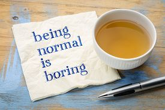

{fig-align="center"}

When I was first studying probability theory as an undergrad, I had a bit of a conceptual hang-up with the Central Limit Theorem. [Simulating it in R](http://www.rpubs.com/christopher_castle/137490) gave a nice visual of how each additional random variable smoothed out some of the original distribution's individuality, and asymptotically we were left with a more generic shape. The proofs were relatively straightforward. One part, however, didn't really make sense to me. My problem was this: **Of all the many possible distributions, why is the normal distribution in particular that our i.i.d random variables converge to in distribution?**

<!--more-->

The normal distribution has lots of interesting properties that I looked at to gain some intuition, but many of the them seem to follow from the CLT, rather than explaining it. In fact, it wasn't until a later course in machine learning that integrated some [information theory](https://en.wikipedia.org/wiki/Information_theory) that I found a satisfactory answer to my question.

In this post, I'll explain an insight from the principle of maximum entropy that conceptually justifies the normal distribution's role in the CLT. To do so, we'll first build up a basic introduction to entropy, how probability and entropy interact, and then explain the entropy property of the normal distribution that helped me understand the question above. For this post, all you'll really need is a rough idea of what a random variable is, and some familiarity with common probability distributions; we'll build up the rest from scratch.

## Entropy
Imagine two situations in which you've lost your keys at home. In the first scenario, you're well and truly confused as to where they are. As far as you're concerned, any location within your home is equally likely. In the second scenario, you remember having them by your kitchen counter, so you're pretty sure they're there, or at least somewhere near there. Intuitively, the knowledge that they're probably in your kitchen is much, much more informative that the idea that they're equally likely to be anywhere in your house. In fact, once you accept the constraint that they're within the bounds of your house, it's pretty hard to imagine a more useless, uninformative statement than "they're equally likely to be anywhere".

Information theory helps makes rigorous many of our informal ideas about how much information or uncertainty is contained in situations like the above. Let's start then, by defining **entropy**, a measure of the uncertainty of a random variable:

$$H(X) = - \int_{I} p(x) \log{p(x)} dx$$

Where p(x) is our continuous probability distribution over some interval I. It can be analogously defined for the discrete case by replacing the integral with a summation. To stress the intuition here, the higher the entropy, the less we know about the value of the random variable. As an example, a uniform distribution over the bounds $[a,b]$ is analogous to our "keys could be anywhere" scenario- the entropy of our variable is high. In fact, once you accept the constraint that the distribution is supported on [a,b], one can prove that the uniform distribution is the maximum entropy distribution among all continuous distributions on that interval. We won't include the proof here, but showing a similar maximum entropy property about the normal distribution is where we're headed.

Before we get back to the normal distribution and CLT though, let's think a little bit more about the concept of maximum entropy. Why would we want to use something specifically because it's minimally informative? Let's think about how we'd express or model our belief that our keys are equally likely to be anywhere. If we're truly of the belief that they're equally likely to be anywhere in our house, then some sort of model based on a uniform distribution over the space likely makes sense. If they're equally likely to be anywhere, placing high probability in a specific room would be wrong, and making that additional assumption would probably slow down our search. This is Jaynes' principle of maximum entropy- we should use the distribution with the highest entropy, subject to any prior constraints we already have.

This principle, then, is about epistemic modesty. We can want to choose the distribution that meets our constraints, and assumes as little additional information as possible.

## The Normal Distribution
Once you specify a variance $\sigma^{2}$, and that the distribution be supported on the reals from $(- \infty, \infty)$, the normal distribution is the maximum entropy distribution! [Thomas Lumley](http://notstatschat.tumblr.com/post/146886495511/how-do-we-prove-the-central-limit-theorem) calls this a "a precise characterization of the normal's boringness". In our mental image of the CLT at work then, we're approaching the normal because of it's generic-ness, it's lack of information. If we were mixing colors, the normal would be a nondescript grey.

In one sense, this result may be counter intuitive. As statisticians, when we find out that a distribution we're working with is roughly normal, we tend to feel like we have a lot to work with. Many of our favorite tools like maximum likelihood will work well, and we have straightforward ways to estimate most quantities of interest. However, this result illustrates a subtle point: ease of use and information content aren't the same thing.

If you found this use of information theory improved your intuition for probability and want more, here are some suggestions for further reading-

## Resources:
* If you're wondering how we actually prove that the normal is the maximum entropy distribution for a specified variance, there's a self-contained proof in section [19.4.2 of Deep Learning](http://www.deeplearningbook.org/contents/inference.html). I excluded it in this post because it required a lot of extra math, and didn't add much to the intuitive point I was trying to show.
* [Chris Olah's Visual Information Theory](http://colah.github.io/posts/2015-09-Visual-Information/) is a great introduction to the information compression and distribution comparison parts of information theory.
